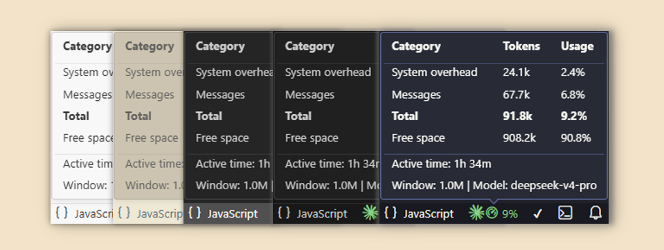
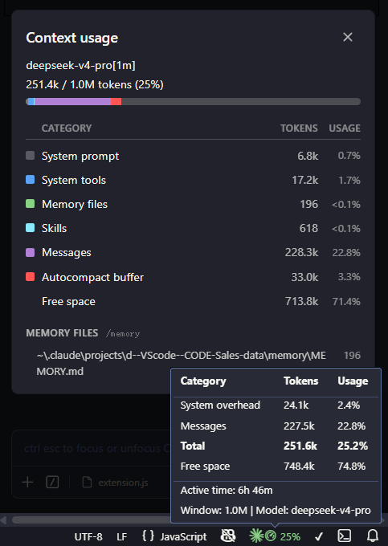

# VSCode Claude Usage Monitor
 [English](./README.md) | [中文](./README_zh.md) 

Real-time context window usage and session active time display for the VSCode Claude Code extension. Glance at your status bar, stay in the flow.

## Tooltip Details



- **Token Breakdown** — Context split into System overhead / Messages / Total / Free space, clear at a glance
- **Active Time** — Tracks Claude's actual working time (thinking/responding), automatically skipping idle periods (>15 min inactivity)
- **Model & Window** — Displays current model name and context window size, covering 46 mainstream models with support for custom additions via `settings.json`
- **Incremental Updates** — Each poll only reads newly added file content, never re-parses processed data, zero system burden
- **Auto Session Matching** — Automatically identifies the active session across multiple workspaces/sessions

> Note: When switching sessions, the tooltip may not update immediately due to caching. Simply send a new message in the session or reload the window.

## vs. `/context` Command

<div align="center">
  
</div>

## Key Differences from Upstream

- The original plugin uses Claude's `statusline` command to fetch context data, which **blocks other statusline tools** such as `ccometixline` and `ccstatusline`. This fork parses data directly from the `.jsonl` session files that Claude automatically generates in your workspace — no conflict with any statusline tool
- Adds four-category token breakdown, session active time, and automatic model recognition, with support for custom model names and context window sizes
- Bridge script has been deprecated; all functionality is implemented in `extension.js` alone

## Performance

- **Zero External Dependencies** — Pure Node.js built-in modules (`fs`, `path`, `os`). No Python 3, no bridge script
- **Tail Scanning** — Only reads the last 512KB of the file for the assistant line, never scans the full file
- **15-Second Polling** — Configurable interval (`fuel-gauge.pollInterval`), each update cycle takes < 1ms
- **Incremental Reading** — Active time computation only reads new bytes when the file grows; zero I/O when file size is unchanged

## Installation

1. Install the original [Claude Code Fuel Gauge](https://marketplace.visualstudio.com/items?itemName=makingaipractical.claude-code-fuel-gauge) extension in VSCode
2. Download  `src/extension.js` from this repository and replace it at `~/.vscode/extensions/makingaipractical.claude-code-fuel-gauge-0.5.1/out/extension.ts`
3. Run `Developer: Reload Window` in VSCode

To customize `systemOverhead`, model name, or context window sizes, add them to `settings.json` (see [Configuration](#configuration)).

## Configuration

In VSCode `settings.json`:

| Setting | Default | Description |
|--------|--------|-------------|
| `fuel-gauge.systemOverhead` | `18000` | System overhead tokens |
| `fuel-gauge.pollInterval` | `15` | Polling interval (seconds) |
| `fuel-gauge.warningThreshold` | `60` | Yellow warning threshold (%) |
| `fuel-gauge.dangerThreshold` | `80` | Red danger threshold (%) |
| `fuel-gauge.model` | `""` | Custom model name |
| `fuel-gauge.modelContextLength` | `{}` | Custom model Context Length |

Example:

```json
{
    "fuel-gauge.systemOverhead": 24100,
    "fuel-gauge.model": "my-new-model",
    "fuel-gauge.modelContextLength": {
        "my-new-model": 500000
    }
}
```

> `systemOverhead` defaults to 18000. Calibrate it against the System prompt and System tools values from the `/context` command.

> `fuel-gauge.model` and `fuel-gauge.modelContextLength` appear gray in `settings.json` because they are not registered in VSCode's configuration schema. This is purely a static validation hint from VSCode — they work exactly as intended.

## System Requirements

- VS Code 1.93+
- Original Claude Code Fuel Gauge extension installed

## Acknowledgments

Forked from [makingaipractical/claude-code-fuel-gauge](https://github.com/makingaipractical/claude-code-fuel-gauge). Thanks to the original author for their contribution to the open-source community.

## License

MIT License — see [LICENSE](LICENSE). Copyright (c) 2026 MakingAIPractical.
